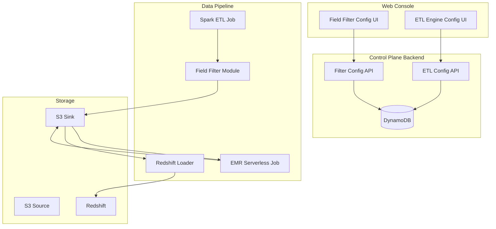
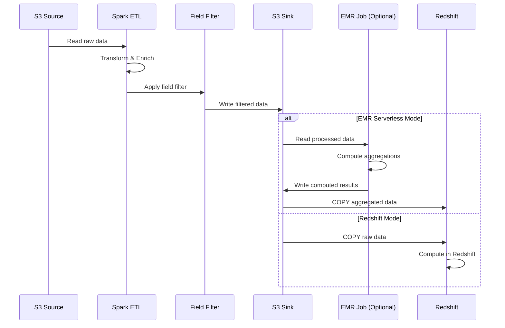

# Design Document: Field Filter and EMR ETL Engine

## Overview

本设计文档描述了 Clickstream Analytics 解决方案的两个新功能的技术实现：
1. **字段过滤功能**：在 Spark ETL 处理过程中根据配置过滤数据字段
2. **EMR Serverless ETL 引擎选项**：支持在 EMR Serverless 中执行聚合计算，然后将结果加载到 Redshift

### 设计原则

- 向后兼容：默认行为与现有系统一致
- 配置驱动：通过 Web 控制台配置，无需重新部署
- 分层配置：支持全局配置和按应用配置，按应用配置优先
- 最小侵入：尽量复用现有组件和架构

## Architecture

### 整体架构



### 数据流



## Components and Interfaces

### 1. Field Filter Configuration Model

```typescript
interface FieldFilterConfig {
  projectId: string;
  appId?: string;  // undefined for global config
  filterMode: 'none' | 'whitelist' | 'blacklist';
  whitelist: string[];
  blacklist: string[];
  createdAt: number;
  updatedAt: number;
}

interface FieldFilterRule {
  fieldPath: string;  // e.g., "event_params.custom_*"
  isWildcard: boolean;
}
```

### 2. ETL Engine Configuration Model

```typescript
interface ETLEngineConfig {
  projectId: string;
  appId?: string;  // undefined for global config
  engineType: 'Redshift' | 'EMR_Serverless';
  emrConfig?: {
    executorMemory: string;  // e.g., "4g"
    executorCores: number;
    driverMemory: string;
    driverCores: number;
  };
  createdAt: number;
  updatedAt: number;
}
```

### 3. Backend API Endpoints

```typescript
// Field Filter APIs
POST   /api/project/{projectId}/filter-config
GET    /api/project/{projectId}/filter-config
PUT    /api/project/{projectId}/filter-config
DELETE /api/project/{projectId}/filter-config

POST   /api/project/{projectId}/app/{appId}/filter-config
GET    /api/project/{projectId}/app/{appId}/filter-config
PUT    /api/project/{projectId}/app/{appId}/filter-config
DELETE /api/project/{projectId}/app/{appId}/filter-config

// ETL Engine APIs
POST   /api/project/{projectId}/etl-config
GET    /api/project/{projectId}/etl-config
PUT    /api/project/{projectId}/etl-config

POST   /api/project/{projectId}/app/{appId}/etl-config
GET    /api/project/{projectId}/app/{appId}/etl-config
PUT    /api/project/{projectId}/app/{appId}/etl-config
```

### 4. Field Filter Java Module

```java
public interface FieldFilter {
    Dataset<Row> applyFilter(Dataset<Row> dataset, FieldFilterConfig config);
    boolean isProtectedField(String fieldName);
    List<String> matchWildcard(String pattern, List<String> fields);
}

public class FieldFilterImpl implements FieldFilter {
    private static final Set<String> PROTECTED_FIELDS = Set.of(
        "event_id", "event_timestamp", "event_name", 
        "user_pseudo_id", "user_id", "app_id"
    );
    
    @Override
    public Dataset<Row> applyFilter(Dataset<Row> dataset, FieldFilterConfig config) {
        // Implementation
    }
}
```

### 5. Frontend Components

```typescript
// Field Filter Configuration Component
interface FieldFilterConfigProps {
  projectId: string;
  appId?: string;
  onSave: (config: FieldFilterConfig) => void;
}

// ETL Engine Configuration Component
interface ETLEngineConfigProps {
  projectId: string;
  appId?: string;
  onSave: (config: ETLEngineConfig) => void;
}
```

## Data Models

### DynamoDB Table Schema

#### FieldFilterConfig Table

| Attribute | Type | Description |
|-----------|------|-------------|
| PK | String | `PROJECT#{projectId}` |
| SK | String | `FILTER#GLOBAL` or `FILTER#APP#{appId}` |
| filterMode | String | `none`, `whitelist`, or `blacklist` |
| whitelist | List | List of field names/patterns |
| blacklist | List | List of field names/patterns |
| createdAt | Number | Creation timestamp |
| updatedAt | Number | Last update timestamp |

#### ETLEngineConfig Table

| Attribute | Type | Description |
|-----------|------|-------------|
| PK | String | `PROJECT#{projectId}` |
| SK | String | `ETL#GLOBAL` or `ETL#APP#{appId}` |
| engineType | String | `Redshift` or `EMR_Serverless` |
| emrConfig | Map | EMR configuration (optional) |
| createdAt | Number | Creation timestamp |
| updatedAt | Number | Last update timestamp |

### S3 Configuration File Format

配置也会同步到 S3，供 Spark ETL 作业读取：

```json
{
  "projectId": "project-001",
  "globalFilter": {
    "filterMode": "blacklist",
    "whitelist": [],
    "blacklist": ["sensitive_field", "internal_*"]
  },
  "appFilters": {
    "app-001": {
      "filterMode": "whitelist",
      "whitelist": ["event_name", "event_timestamp", "custom_field"],
      "blacklist": []
    }
  },
  "globalETL": {
    "engineType": "EMR_Serverless",
    "emrConfig": {
      "executorMemory": "4g",
      "executorCores": 2
    }
  },
  "appETL": {
    "app-001": {
      "engineType": "Redshift"
    }
  }
}
```

## Correctness Properties

*A property is a characteristic or behavior that should hold true across all valid executions of a system-essentially, a formal statement about what the system should do. Properties serve as the bridge between human-readable specifications and machine-verifiable correctness guarantees.*

### Property 1: Filter Mode Behavior

*For any* dataset and filter configuration, when filter mode is "none", the output dataset SHALL contain all fields from the input dataset unchanged.

**Validates: Requirements 1.2**

### Property 2: Whitelist Filter Correctness

*For any* dataset and whitelist configuration, the output dataset SHALL only contain fields that are either in the whitelist OR are protected system fields.

**Validates: Requirements 1.3, 3.4**

### Property 3: Blacklist Filter Correctness

*For any* dataset and blacklist configuration, the output dataset SHALL NOT contain any fields that are in the blacklist EXCEPT for protected system fields.

**Validates: Requirements 1.4, 3.4, 3.5**

### Property 4: Blacklist Priority

*For any* filter configuration where a field appears in both whitelist and blacklist, the field SHALL be excluded from the output (blacklist takes priority), unless it is a protected system field.

**Validates: Requirements 1.5**

### Property 5: Configuration Precedence

*For any* project with both global and app-specific filter configurations, when processing data for a specific app, the app-specific configuration SHALL be used instead of the global configuration.

**Validates: Requirements 1.6, 1.7**

### Property 6: Protected Fields Preservation

*For any* filter configuration (whitelist or blacklist), all protected system fields (event_id, event_timestamp, event_name, user_pseudo_id, user_id, app_id) SHALL always be present in the output dataset.

**Validates: Requirements 3.4, 3.5**

### Property 7: Wildcard Pattern Matching

*For any* wildcard pattern in the filter configuration, all fields matching the pattern SHALL be correctly identified and filtered according to the filter mode.

**Validates: Requirements 3.6**

### Property 8: Configuration Round-Trip

*For any* valid FieldFilterConfig object, serializing to JSON and then parsing back SHALL produce an equivalent configuration object.

**Validates: Requirements 4.4, 4.5**

### Property 9: Default Configuration Values

*For any* new project or app without explicit configuration, the filter mode SHALL default to "none" and ETL engine SHALL default to "Redshift".

**Validates: Requirements 10.1, 10.2**

### Property 10: Filter Application Scope

*For any* dataset containing event_params, user_properties, and item attributes, the field filter SHALL be applied to all three attribute types consistently according to the configuration.

**Validates: Requirements 3.1, 3.2, 3.3**

## Error Handling

### Field Filter Errors

| Error Condition | Handling Strategy |
|-----------------|-------------------|
| Invalid field pattern | Log warning, skip invalid pattern |
| Protected field in blacklist | Log warning, retain field |
| Empty whitelist | Log warning, pass all fields |
| Configuration not found | Use default (none mode) |
| S3 config read failure | Retry 3 times, then use cached config |

### ETL Engine Errors

| Error Condition | Handling Strategy |
|-----------------|-------------------|
| EMR job failure | Log error, send CloudWatch alarm, retry up to 3 times |
| Redshift COPY failure | Log error, retry with exponential backoff |
| Configuration validation failure | Return 400 error with descriptive message |
| Mode switch during active job | Queue switch, apply after current job completes |

### API Error Responses

```typescript
interface ErrorResponse {
  statusCode: number;
  message: string;
  errorCode: string;
  details?: Record<string, any>;
}

// Example error codes
const ERROR_CODES = {
  INVALID_FILTER_MODE: 'INVALID_FILTER_MODE',
  INVALID_FIELD_PATTERN: 'INVALID_FIELD_PATTERN',
  PROTECTED_FIELD_CONFLICT: 'PROTECTED_FIELD_CONFLICT',
  CONFIG_NOT_FOUND: 'CONFIG_NOT_FOUND',
  EMR_JOB_FAILED: 'EMR_JOB_FAILED',
  REDSHIFT_LOAD_FAILED: 'REDSHIFT_LOAD_FAILED',
};
```

## Testing Strategy

### Unit Tests

1. **Field Filter Logic Tests**
   - Test each filter mode (none, whitelist, blacklist)
   - Test protected field preservation
   - Test wildcard pattern matching
   - Test configuration precedence (app vs global)

2. **Configuration Parser Tests**
   - Test JSON schema validation
   - Test nested field path parsing
   - Test error handling for malformed config

3. **API Endpoint Tests**
   - Test CRUD operations for filter config
   - Test CRUD operations for ETL config
   - Test validation error responses

### Property-Based Tests

Property-based tests will use **fast-check** library for TypeScript/JavaScript and **jqwik** for Java.

Each property test should:
- Run minimum 100 iterations
- Generate random valid inputs
- Verify the property holds for all generated inputs
- Tag with: **Feature: emr-etl-field-filter, Property {number}: {property_text}**

### Integration Tests

1. **End-to-End Filter Test**
   - Configure filter via Web Console
   - Run ETL job
   - Verify filtered data in S3/Redshift

2. **ETL Engine Switch Test**
   - Switch from Redshift to EMR mode
   - Verify data consistency
   - Switch back and verify

3. **Configuration Sync Test**
   - Update config via API
   - Verify S3 config file updated
   - Verify Spark job reads new config
