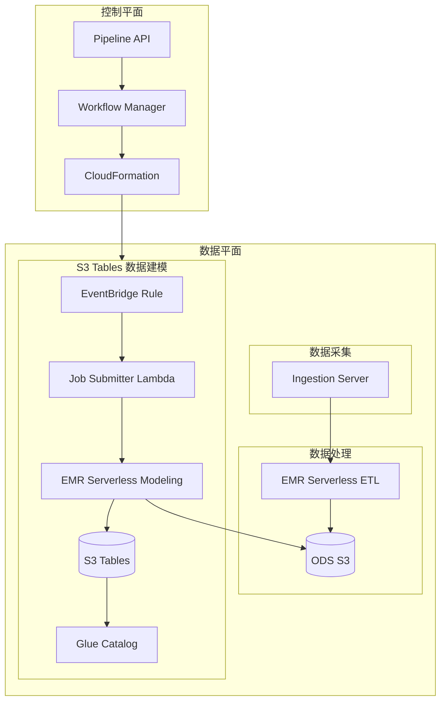
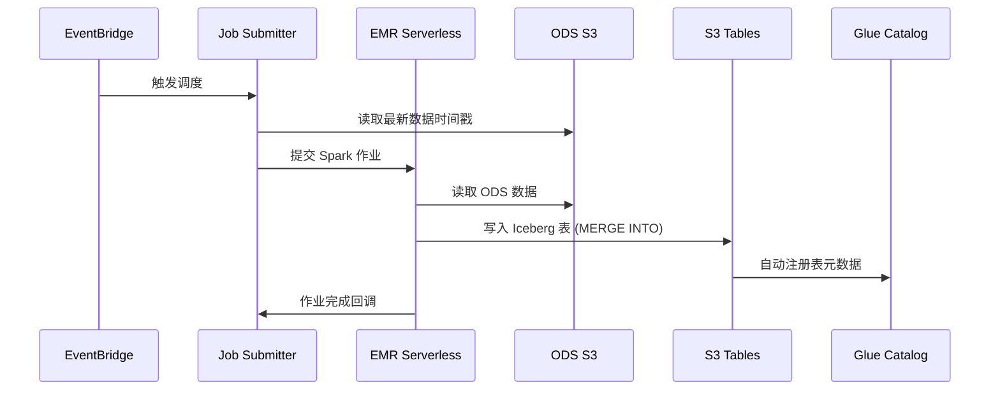

# 设计文档

## 概述

本设计文档描述了为 Clickstream Analytics on AWS 添加 EMR Serverless + S3 Tables 数据建模功能的技术实现方案。该功能允许用户选择使用 S3 Tables（基于 Apache Iceberg 格式）作为数据建模的目标存储，作为现有 Redshift 数据建模的替代方案。

### 设计目标

1. 提供与现有 Redshift 建模选项互斥的 S3 Tables 建模选项
2. 复用现有的 EMR Serverless 基础设施进行数据建模
3. 使用 Apache Iceberg 格式确保数据一致性和幂等性
4. 保持与现有系统的向后兼容性

### 技术栈

- EMR Serverless 7.5+ (支持 S3 Tables)
- Apache Iceberg 表格式
- AWS S3 Tables 服务
- AWS Glue Data Catalog
- AWS Lambda (作业提交)
- AWS EventBridge (调度)

## 架构

### 整体架构图



### 数据流



## 组件和接口

### 1. 数据模型扩展

#### IPipeline 接口扩展

```typescript
// src/control-plane/backend/lambda/api/model/pipeline.ts

export interface S3TablesModelingConfig {
  readonly tableBucketArn: string;      // S3 Table Bucket ARN
  readonly namespace?: string;           // 命名空间，默认 clickstream_{projectId}
  readonly scheduleExpression: string;   // 调度表达式
  readonly dataRetentionDays?: number;   // 数据保留天数，默认 365
}

export interface DataModeling {
  readonly ods?: {
    readonly bucket: S3Bucket;
    readonly fileSuffix: string;
  };
  readonly redshift?: { /* 现有配置 */ };
  readonly s3Tables?: S3TablesModelingConfig;  // 新增
  readonly athena: boolean;
  readonly loadWorkflow?: { /* 现有配置 */ };
}
```

#### 配置互斥验证

```typescript
// 在 Pipeline 验证逻辑中
if (pipeline.dataModeling?.redshift && pipeline.dataModeling?.s3Tables) {
  throw new ClickStreamBadRequestError(
    'Redshift and S3 Tables data modeling are mutually exclusive.'
  );
}
```

### 2. CS3TablesModelingStack 类

```typescript
// src/control-plane/backend/lambda/api/model/stacks.ts

export class CS3TablesModelingStack extends JSONObject {
  public static editAllowedList(): string[] {
    return [
      'ScheduleExpression',
      'DataRetentionDays',
      'AppIds',
    ];
  }

  @JSONObject.required
  _pipeline?: IPipeline;

  @JSONObject.required
  _resources?: CPipelineResources;

  // 基础参数
  @JSONObject.optional('')
  VpcId?: string;

  @JSONObject.optional('')
  PrivateSubnetIds?: string;

  @JSONObject.optional('')
  ProjectId?: string;

  @JSONObject.optional('')
  AppIds?: string;

  // S3 Tables 特定参数
  @JSONObject.optional('')
  S3TableBucketArn?: string;

  @JSONObject.optional('')
  S3TableNamespace?: string;

  @JSONObject.optional('cron(0 2 * * ? *)')
  ScheduleExpression?: string;

  @JSONObject.optional(365)
  DataRetentionDays?: number;

  // ODS 数据源参数
  @JSONObject.optional('')
  OdsS3Bucket?: string;

  @JSONObject.optional('')
  OdsS3Prefix?: string;

  @JSONObject.optional('.snappy.parquet')
  OdsFileSuffix?: string;

  // Pipeline 参数
  @JSONObject.optional('')
  PipelineS3Bucket?: string;

  @JSONObject.optional('')
  PipelineS3Prefix?: string;

  @JSONObject.optional('')
  IamRoleBoundaryArn?: string;
}
```

### 3. CDK Stack 实现

#### S3TablesModelingStack

```typescript
// src/s3-tables-modeling-stack.ts

export class S3TablesModelingStack extends Stack {
  constructor(scope: Construct, id: string, props: S3TablesModelingStackProps) {
    super(scope, id, props);
    
    // 1. EMR Serverless Application
    const emrApp = new CfnApplication(this, 'S3TablesModelingEMRApp', {
      releaseLabel: 'emr-7.5.0',
      type: 'SPARK',
      name: `clickstream-s3tables-${props.projectId}`,
      networkConfiguration: {
        subnetIds: props.subnetIds,
        securityGroupIds: props.securityGroupIds,
      },
      autoStartConfiguration: { enabled: true },
      autoStopConfiguration: { enabled: true, idleTimeoutMinutes: 15 },
    });
    
    // 2. EMR 执行角色
    const emrExecutionRole = new Role(this, 'EMRExecutionRole', {
      assumedBy: new ServicePrincipal('emr-serverless.amazonaws.com'),
    });
    
    // S3 Tables 权限
    emrExecutionRole.addToPolicy(new PolicyStatement({
      actions: ['s3tables:*'],
      resources: [props.tableBucketArn, `${props.tableBucketArn}/*`],
    }));
    
    // S3 ODS 读取权限
    emrExecutionRole.addToPolicy(new PolicyStatement({
      actions: ['s3:GetObject', 's3:ListBucket'],
      resources: [props.odsBucket.bucketArn, `${props.odsBucket.bucketArn}/*`],
    }));
    
    // Glue Catalog 权限
    emrExecutionRole.addToPolicy(new PolicyStatement({
      actions: ['glue:*'],
      resources: ['*'],
    }));
    
    // 3. Lambda 作业提交器
    const jobSubmitter = new Function(this, 'JobSubmitterLambda', {
      runtime: Runtime.NODEJS_18_X,
      handler: 'index.handler',
      code: Code.fromAsset('lambda/s3tables-job-submitter'),
      environment: {
        EMR_APPLICATION_ID: emrApp.attrApplicationId,
        EMR_EXECUTION_ROLE_ARN: emrExecutionRole.roleArn,
        S3_TABLE_BUCKET_ARN: props.tableBucketArn,
        S3_TABLE_NAMESPACE: props.namespace,
        ODS_S3_BUCKET: props.odsBucket.bucketName,
        ODS_S3_PREFIX: props.odsPrefix,
      },
    });
    
    // 4. EventBridge 调度规则
    const rule = new Rule(this, 'ScheduleRule', {
      schedule: Schedule.expression(props.scheduleExpression),
    });
    rule.addTarget(new LambdaFunction(jobSubmitter));
    
    // 5. 输出
    new CfnOutput(this, 'EMRApplicationId', {
      value: emrApp.attrApplicationId,
    });
  }
}
```

### 4. Workflow 集成

```typescript
// src/control-plane/backend/lambda/api/model/pipeline.ts

private async getS3TablesModelingState(): Promise<WorkflowState | undefined> {
  if (isEmpty(this.pipeline.dataModeling?.s3Tables)) {
    return undefined;
  }
  
  const templateURL = await this.getTemplateUrl(PipelineStackType.DATA_MODELING_S3_TABLES);
  if (!templateURL) {
    throw new ClickStreamBadRequestError('Template: s3-tables-modeling not found.');
  }
  
  const stack = new CS3TablesModelingStack(this.pipeline, this.resources!);
  const parameters = getStackParameters(
    stack, 
    SolutionVersion.Of(this.pipeline.templateVersion ?? FULL_SOLUTION_VERSION)
  );
  
  const stackName = getStackName(
    this.pipeline.pipelineId, 
    PipelineStackType.DATA_MODELING_S3_TABLES, 
    this.pipeline.ingestionServer.sinkType
  );
  
  return {
    Type: WorkflowStateType.STACK,
    Data: {
      Input: {
        Action: 'Create',
        Region: this.pipeline.region,
        StackName: stackName,
        TemplateURL: templateURL,
        Parameters: parameters,
        Tags: this.stackTags,
      },
      Callback: {
        BucketName: stackWorkflowS3Bucket ?? '',
        BucketPrefix: `clickstream/workflow/${this.pipeline.executionDetail?.name}`,
      },
    },
    End: true,
  };
}
```

## 数据模型

### S3 Tables 表结构

#### 1. event_daily_summary

```sql
CREATE TABLE s3tablesbucket.{namespace}.event_daily_summary (
  app_id STRING,
  event_date DATE,
  event_name STRING,
  platform STRING,
  geo_country STRING,
  event_count BIGINT,
  user_count BIGINT,
  session_count BIGINT,
  updated_at TIMESTAMP
)
USING iceberg
PARTITIONED BY (event_date)
```

#### 2. event_hourly_summary

```sql
CREATE TABLE s3tablesbucket.{namespace}.event_hourly_summary (
  app_id STRING,
  event_hour TIMESTAMP,
  event_name STRING,
  platform STRING,
  geo_country STRING,
  event_count BIGINT,
  user_count BIGINT,
  session_count BIGINT,
  updated_at TIMESTAMP
)
USING iceberg
PARTITIONED BY (days(event_hour))
```

#### 3. user_behavior

```sql
CREATE TABLE s3tablesbucket.{namespace}.user_behavior (
  app_id STRING,
  user_id STRING,
  user_pseudo_id STRING,
  first_visit_date DATE,
  last_visit_date DATE,
  total_sessions BIGINT,
  total_events BIGINT,
  ltv DOUBLE,
  updated_at TIMESTAMP
)
USING iceberg
PARTITIONED BY (bucket(16, user_pseudo_id))
```

#### 4. session_analysis

```sql
CREATE TABLE s3tablesbucket.{namespace}.session_analysis (
  app_id STRING,
  session_id STRING,
  user_pseudo_id STRING,
  event_date DATE,
  session_start_time TIMESTAMP,
  session_end_time TIMESTAMP,
  session_duration BIGINT,
  page_views INT,
  events_count INT,
  bounce_flag BOOLEAN,
  updated_at TIMESTAMP
)
USING iceberg
PARTITIONED BY (event_date)
```

#### 5. retention_daily

```sql
CREATE TABLE s3tablesbucket.{namespace}.retention_daily (
  app_id STRING,
  cohort_date DATE,
  day_number INT,
  cohort_users BIGINT,
  retained_users BIGINT,
  retention_rate DOUBLE,
  updated_at TIMESTAMP
)
USING iceberg
PARTITIONED BY (cohort_date)
```

### Spark 作业配置

```properties
# EMR Serverless Spark 配置
spark.jars=/usr/share/aws/iceberg/lib/iceberg-spark3-runtime.jar,/usr/share/aws/s3-tables/lib/s3-tables-catalog-for-iceberg-runtime.jar
spark.sql.extensions=org.apache.iceberg.spark.extensions.IcebergSparkSessionExtensions
spark.sql.catalog.s3tablesbucket=org.apache.iceberg.spark.SparkCatalog
spark.sql.catalog.s3tablesbucket.catalog-impl=software.amazon.s3tables.iceberg.S3TablesCatalog
spark.sql.catalog.s3tablesbucket.warehouse=arn:aws:s3tables:{region}:{account}:bucket/{bucket-name}
```

## 正确性属性

*正确性属性是一种特征或行为，应该在系统的所有有效执行中保持为真——本质上是关于系统应该做什么的正式声明。属性作为人类可读规范和机器可验证正确性保证之间的桥梁。*

### Property 1: S3 Tables 和 Redshift 配置互斥

*For any* Pipeline 配置，如果同时提供了 dataModeling.s3Tables 和 dataModeling.redshift 配置，系统应该拒绝该配置并返回错误。

**Validates: Requirements 1.6, 8.5**

### Property 2: Stack 参数生成完整性

*For any* 有效的 S3 Tables 建模配置，CS3TablesModelingStack 生成的 CloudFormation 参数应该包含所有必需参数（VpcId、PrivateSubnetIds、ProjectId、AppIds、S3TableBucketArn、S3TableNamespace、ScheduleExpression、OdsS3Bucket、OdsS3Prefix）。

**Validates: Requirements 2.3, 2.4, 2.5, 2.6**

### Property 3: Namespace 默认值生成

*For any* Pipeline 配置，如果 s3Tables.namespace 未提供，系统应该生成默认值 "clickstream_{projectId}"，其中 projectId 来自 Pipeline 配置。

**Validates: Requirements 1.3**

### Property 4: Workflow 顺序正确性

*For any* 包含 S3 Tables 建模的 Pipeline，生成的工作流中 DATA_MODELING_S3_TABLES Stack 应该在 DATA_PROCESSING Stack 之后执行。

**Validates: Requirements 4.2, 4.3**

### Property 5: 数据建模幂等性

*For any* 数据建模作业，对同一时间范围的数据重复执行应该产生相同的结果，不会创建重复记录。

**Validates: Requirements 5.7, 13.2**

### Property 6: 事件聚合正确性

*For any* ODS event_v2 数据集，EventAggregationJob 生成的 event_daily_summary 表中的 event_count 应该等于按相同维度（app_id、event_date、event_name、platform、geo_country）分组的原始事件数量。

**Validates: Requirements 5.3**

### Property 7: 用户行为计算正确性

*For any* 用户，user_behavior 表中的 first_visit_date 应该等于该用户在 ODS 数据中的最早事件日期，last_visit_date 应该等于最晚事件日期。

**Validates: Requirements 5.4**

### Property 8: 会话分析正确性

*For any* 会话，session_analysis 表中的 events_count 应该等于该会话在 ODS event_v2 表中的事件数量。

**Validates: Requirements 5.5**

### Property 9: 留存率计算正确性

*For any* 队列日期和天数 N，retention_daily 表中的 retention_rate 应该等于 retained_users / cohort_users，其中 retained_users 是在第 N 天仍然活跃的用户数。

**Validates: Requirements 5.6**

### Property 10: 作业提交重试逻辑

*For any* 作业提交失败，Lambda 应该使用指数退避策略重试，重试间隔应该按 2^n 秒增长（n 为重试次数）。

**Validates: Requirements 6.5**

### Property 11: API 配置验证

*For any* Pipeline 创建或更新请求，如果 s3Tables.tableBucketArn 格式无效（不符合 ARN 格式），系统应该返回验证错误。

**Validates: Requirements 8.4**

### Property 12: 向后兼容性

*For any* 现有 Pipeline（没有 s3Tables 配置），系统升级后应该继续正常运行，不需要任何配置更改。

**Validates: Requirements 14.1, 14.3, 14.4**

### Property 13: 表分区正确性

*For any* S3 Tables 表，数据应该按照定义的分区键（event_date 或 cohort_date）正确分区，查询特定日期范围时应该只扫描相关分区。

**Validates: Requirements 13.5**

### Property 14: 延迟数据处理

*For any* 延迟到达的数据（event_timestamp 早于当前处理窗口），系统应该使用 watermark 机制正确处理，将数据合并到正确的分区中。

**Validates: Requirements 13.3**

## 错误处理

### 1. 配置验证错误

| 错误场景 | 错误码 | 错误消息 |
|---------|--------|---------|
| S3 Tables 和 Redshift 同时配置 | 400 | Redshift and S3 Tables data modeling are mutually exclusive |
| tableBucketArn 格式无效 | 400 | Invalid S3 Table Bucket ARN format |
| scheduleExpression 格式无效 | 400 | Invalid schedule expression format |
| dataRetentionDays 超出范围 | 400 | Data retention days must be between 1 and 3650 |

### 2. 运行时错误

| 错误场景 | 处理策略 |
|---------|---------|
| EMR 作业提交失败 | 指数退避重试，最多 3 次 |
| S3 Tables 写入失败 | 记录错误日志，标记作业失败 |
| ODS 数据读取失败 | 检查 S3 权限，记录详细错误 |
| Glue Catalog 更新失败 | 重试一次，失败则记录警告 |

### 3. 错误恢复

```typescript
// Lambda 作业提交器错误处理
async function submitJobWithRetry(params: JobParams, maxRetries = 3): Promise<string> {
  let lastError: Error;
  for (let i = 0; i < maxRetries; i++) {
    try {
      return await submitJob(params);
    } catch (error) {
      lastError = error;
      const delay = Math.pow(2, i) * 1000; // 指数退避
      await sleep(delay);
    }
  }
  throw lastError;
}
```

## 测试策略

### 单元测试

1. **CS3TablesModelingStack 参数生成测试**
   - 测试所有参数正确生成
   - 测试默认值应用
   - 测试参数验证

2. **Workflow 生成测试**
   - 测试 S3 Tables 建模状态生成
   - 测试工作流顺序
   - 测试与现有工作流的集成

3. **配置验证测试**
   - 测试互斥验证
   - 测试 ARN 格式验证
   - 测试调度表达式验证

### 属性测试

使用 fast-check 或 jqwik 进行属性测试：

1. **幂等性测试** - 验证重复执行产生相同结果
2. **聚合正确性测试** - 验证聚合计算正确
3. **分区正确性测试** - 验证数据正确分区

```typescript
// 示例：幂等性属性测试
// Feature: s3-tables-data-modeling, Property 5: 数据建模幂等性
fc.assert(
  fc.property(
    fc.array(eventDataArbitrary, { minLength: 1, maxLength: 100 }),
    (events) => {
      const result1 = runModelingJob(events);
      const result2 = runModelingJob(events);
      return deepEqual(result1, result2);
    }
  ),
  { numRuns: 100 }
);
```

### 集成测试

1. **端到端数据流测试**
   - 从 ODS 到 S3 Tables 的完整数据流
   - 验证数据正确写入和可查询

2. **API 集成测试**
   - 测试 Pipeline 创建/更新 API
   - 测试作业触发 API
   - 测试状态查询 API

3. **CDK Stack 测试**
   - 快照测试验证资源定义
   - 验证 IAM 权限配置

### 测试配置

- 属性测试最少运行 100 次迭代
- 使用 Jest 作为测试框架
- 使用 fast-check 进行属性测试
- 使用 jqwik 进行 Java Spark 作业的属性测试
