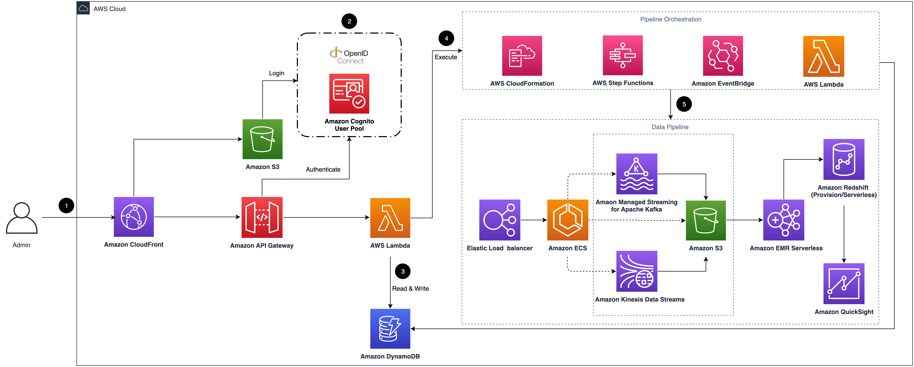

# Clickstream Analytics on AWS Guidance

## Table of Contents

1. [Overview](#overview-required)
    - [Cost](#cost)
    - [Architecture Overview](#architecture-overview)
2. [Prerequisites](#prerequisites)
    - [Operating System](#operating-system)
    - [AWS account requirements](#aws-account-requirements)
    - [aws cdk bootstrap](#aws-cdk-bootstrap)
    - [Supported Regions](#supported-regions)
3. [Deployment Steps](#deployment-steps)
4. [Deployment Validation](#deployment-validation)
5. [Running the Guidance](#running-the-guidance)
6. [Next Steps](#next-steps)
7. [Test](#test)
8. [Local development for web console](#local-development-for-web-console)
9. [Local build spark ETL jar](#local-build-spark-etl-jar)
10. [Cleanup](#cleanup)
11. [FAQ, known issues, additional considerations, and limitations](#faq-known-issues-additional-considerations-and-limitations)
12. [Revisions](#revisions)
13. [Notices](#notices)


## Overview

This solution collects, ingests, analyzes, and visualizes clickstream events from your websites and mobile applications.
Clickstream data is critical for online business analytics use cases, such as user behavior analysis, customer data
platform, and marketing analysis. This data derives insights into the patterns of user interactions on a website or
application, helping businesses understand user navigation, preferences, and engagement levels to drive product
innovation and optimize marketing investments.

With this solution, you can quickly configure and deploy a data pipeline that fits your business and technical needs. It
provides purpose-built software development kits (SDKs) that automatically collect common events and easy-to-use APIs to
report custom events, enabling you to easily send your customers’ clickstream data to the data pipeline in your AWS
account. The solution also offers pre-assembled dashboards that visualize key metrics about user lifecycle, including
acquisition, engagement, activity, and retention, and adds visibility into user devices and geographies. You can combine
user behavior data with business backend data to create a comprehensive data platform and generate insights that drive
business growth.

For more information, refer to [the doc][doc-solution-overview]

### Architecture Overview



1. Amazon CloudFront distributes the frontend web UI assets hosted in the Amazon S3 bucket, and the backend APIs hosted
   with Amazon API Gateway and AWS Lambda.
2. The Amazon Cognito user pool or OpenID Connect (OIDC) is used for authentication.
3. The web UI console uses Amazon DynamoDB to store persistent data.
4. AWS Step Functions, AWS CloudFormation, AWS Lambda, and Amazon EventBridge are used for orchestrating the lifecycle
   management of data pipelines.
5. The data pipeline is provisioned in the Region specified by the system operator. It consists of Application Load
   Balancer (ALB),
   Amazon ECS, Amazon Managed Streaming for Kafka (Amazon MSK), Amazon Kinesis Data Streams, Amazon S3, Amazon EMR
   Serverless, Amazon Redshift, and Amazon QuickSight.

For more information, refer to [the doc][doc-arch].

### Cost

The Clickstream Analytics costs are primarily driven by the data pipeline, with following main components:

* **Ingestion module**, cost varies based on ingestion server size and selected data sink type
* **Data processing and modeling module** (optional), cost determined by module activation and configuration settings
* **Enabled Dashboards** (optional), cost based on module activation and selected configuration options
* **Additional features**

Cost estimates are provided for various data throughput levels (10, 100, 1,000, and 10,000 requests per second)
across different pipeline configurations. Details are shown in [Cost section][doc-cost].

## Prerequisites

* At least four vacant S3 buckets.

### Operating System

These deployment instructions are optimized to best work on **macOS, Linux, or Windows**. The following packages and
tools are required:

* [AWS Command Line Interface](https://aws.amazon.com/cli/)
* [Python](https://www.python.org/) 3.11 or newer
* [Pypi/Pip](https://pypi.org/project/pip/) 25.0 or newer
* [Node.js](https://nodejs.org/en/) 20.12.0 or newer
* [AWS CDK](https://aws.amazon.com/cdk/) 2.140.0 or newer
* [pnpm](https://pnpm.io/) 9.15.3
* [Docker](https://docs.docker.com/engine/)
* [AWS access key ID and secret access key](https://docs.aws.amazon.com/IAM/latest/UserGuide/id_credentials_access-keys.html)
  configured in your environment with AdministratorAccess equivalent permissions

### AWS account requirements

You need an AWS account with AdministratorAccess equivalent permissions to deploy this solution.

### aws cdk bootstrap

This Guidance uses aws-cdk. If you are using aws-cdk for the first time, please perform the bootstrapping:

```bash
cdk bootstrap --cloudformation-execution-policies arn:aws:iam::aws:policy/AdministratorAccess
```

### Supported Regions

Clickstream Analytics uses services which may not be currently available in all AWS Regions.
Launch this solution in an AWS Region where required services are available.

[Supported AWS Regions][doc-supported-aws-regions]

## Deployment Steps

1. Clone the repository:
   ```bash
   git clone https://github.com/aws-solutions/clickstream-analytics-on-aws.git
   cd clickstream-analytics-on-aws
   ```

2. Install pnpm and dependencies:
   ```bash
   npm install -g pnpm@9.15.3
   pnpm install && pnpm projen && pnpm nx build @aws/clickstream-base-lib
   ```

3. Bootstrap CDK (if not done before):
   ```bash
   npx cdk bootstrap
   ```

4. Deploy the stack:

   To deploy code from your local machine to your AWS account, follow the deployment instructions
   in [README.md](./deployment/README.md).
   ```bash
   cd deployment
   sh solution-deploy.sh --region <AWS Region> --profile <AWS Profile Name> --email <User Email> --template-deploy
   ```

5. Note the CloudFront URL from the outputs to access the web console.

## Deployment Validation

After deploying the solution, you can validate the deployment by:

1. Open the AWS CloudFormation console and verify the status of the stack is CREATE_COMPLETE.
2. Navigate to the CloudFront URL provided in the CloudFormation outputs to access the web console.
3. Sign in with the credentials sent to the email address you provided during deployment.
4. Verify you can access the dashboard and create a new data pipeline.
5. For CDK deployment, you can validate by checking the CloudFormation stacks in the console or by running:
   ```bash
   aws cloudformation describe-stacks --stack-name cloudfront-s3-control-plane-stack-global
   ```

## Running the Guidance

After successful deployment, you can start using the Clickstream Analytics solution by following these steps:

1. **Access the Web Console**:
    - Navigate to the CloudFront URL provided in the CloudFormation outputs
    - Sign in with the credentials sent to the email address you provided during deployment

2. **Create a Data Pipeline**:
    - In the web console, navigate to the "Pipelines" section
    - Click "Create pipeline"
    - Follow the wizard to configure your data pipeline based on your requirements
    - Choose the appropriate sink (S3, Kinesis, or MSK)
    - Configure data processing options if needed

3. **Create an App**:
    - After creating a pipeline, navigate to the "Apps" section
    - Click "Create app"
    - Configure your app settings and associate it with the created pipeline
    - Note the app ID and write key for SDK integration

4. **Integrate SDK with Your Application**:
    - Choose the appropriate SDK for your platform (Android, iOS, Web, Flutter, etc.)
    - Follow the [SDK integration guide][doc-sdk-manaul] to implement the SDK in your application
    - Configure the SDK with the app ID and endpoint URL

5. **View Analytics**:
    - Once data starts flowing, you can view analytics in the pre-built dashboards
    - Access user lifecycle metrics, engagement data, and other insights

For step-by-step instructions on building a serverless data pipeline that collects application data, please refer to
the [implementation guide][doc-get-started].

## Next Steps

After successfully deploying and running the Clickstream Analytics, consider these next steps to enhance your
implementation:

1. **Customize Data Collection**:
    - Implement custom events in your applications to capture specific user interactions
    - Use the SDK's API to send custom attributes with events

2. **Enhance Data Processing**:
    - Configure data transformation rules in the ETL process
    - Implement custom plugins for data enrichment

3. **Integrate with Other AWS Services**:
    - Connect your clickstream data with Amazon Personalize for recommendation engines
    - Use Amazon SageMaker for advanced analytics and machine learning on your clickstream data

4. **Scale Your Implementation**:
    - Monitor performance metrics and adjust the pipeline configuration as your traffic grows
    - Consider implementing multi-region deployments for global applications

5. **Develop Custom Dashboards**:
    - Create custom QuickSight dashboards for specific business needs
    - Integrate with your existing business intelligence tools

6. **Implement Data Governance**:
    - Set up data retention policies
    - Implement data privacy controls in accordance with regulations like GDPR or CCPA

For more information, refer to the [Pipeline Management][doc-pipeline-management] section in the implementation guide.

## Cleanup

To clean up all resources deployed by this solution, follow these steps:

1. **Delete Data Pipelines First**:
    - In the web console, navigate to the "Pipelines" section
    - Select each pipeline and click "Delete"
    - Wait for all pipeline deletions to complete before proceeding

2. **Delete Apps**:
    - In the web console, navigate to the "Apps" section
    - Delete all apps you've created

3. **Delete CloudFormation Stacks**:
      ```bash
      aws cloudformation delete-stack --stack-name <stack-name>
      ```

4. **Delete S3 Buckets (optional)**


## Test

```shell
pnpm test
```

## Local development for web console

- Step1: Deploy the solution control plane(create DynamoDB tables, State Machine and other resources). 
- Step2: Open **Amazon Cognito** console, select the corresponding **User pool**, click the **App integration** tab, select application details in the **App client list**, edit **Hosted UI**, and set a new URL: `http://localhost:3000/signin` into **Allowed callback URLs**.
- Step3: Goto the folder: `src/control-plane/local`

```shell
cd src/control-plane/local
```

```shell
# run backend server local
bash start.sh -s backend
```

```shell
# run frontend server local
bash start.sh -s frontend
```

## Local build spark ETL jar

- Step1: Build ETL common

```shell
cd src/data-pipeline/etl-common 
./gradlew clean build install

```

- Step2: Build spark ETL jar

```shell
cd src/data-pipeline/spark-etl

# build with unit tests
./gradlew clean build 

# or only build jar and skip all unit tests 
./gradlew clean build -x test -x :coverageCheck

# check the jar file
ls -l ./build/libs/spark-etl-*.jar

```

## FAQ, known issues, additional considerations, and limitations

- When deploying in regions with limited availability for some AWS services, you may encounter deployment failures. Always check the [supported regions documentation][doc-supported-aws-regions] before deployment.
- Large data volumes may require adjustments to the default configuration settings for optimal performance.
- The first-time ETL job may take longer to complete as it initializes the processing environment.
- For detailed troubleshooting information, refer to the [troubleshooting guide][doc-troubleshooting].

## Revisions

Check the CHANGELOG.md file in the repo to see all notable changes and updates to the software. 
The changelog provides a clear record of improvements and fixes for each version.

## Notices

*Customers are responsible for making their own independent assessment of the information in this Guidance. This
Guidance: (a) is for informational purposes only, (b) represents AWS current product offerings and practices, which are
subject to change without notice, and (c) does not create any commitments or assurances from AWS and its affiliates,
suppliers or licensors. AWS products or services are provided “as is” without warranties, representations, or conditions
of any kind, whether express or implied. AWS responsibilities and liabilities to its customers are controlled by AWS
agreements, and this Guidance is not part of, nor does it modify, any agreement between AWS and its customers.*

[android-sdk]: https://github.com/aws-solutions/clickstream-analytics-on-aws-android-sdk
[swift-sdk]: https://github.com/aws-solutions/clickstream-analytics-on-aws-swift-sdk
[flutter-sdk]: https://github.com/aws-solutions/clickstream-analytics-on-aws-flutter-sdk
[react-native-sdk]: https://github.com/aws-solutions/clickstream-analytics-on-aws-react-native-sdk
[web-sdk]: https://github.com/aws-solutions/clickstream-analytics-on-aws-web-sdk
[wechat-sdk]: https://github.com/awslabs/clickstream-wechat
[http-api]: https://aws-solutions.github.io/clickstream-analytics-on-aws/en/latest/sdk-manual/http-api/
[configure-aws-cli]: https://docs.aws.amazon.com/zh_cn/cli/latest/userguide/cli-chap-configure.html
[aws-cdk]: https://aws.amazon.com/cdk/
[doc-arch]: https://docs.aws.amazon.com/solutions/latest/clickstream-analytics-on-aws/architecture-overview.html
[doc-deployment]: https://docs.aws.amazon.com/solutions/latest/clickstream-analytics-on-aws/deployment.html
[sdk-samples]: https://github.com/aws-samples/clickstream-sdk-samples
[doc-solution-overview]: https://docs.aws.amazon.com/solutions/latest/clickstream-analytics-on-aws/solution-overview.html
[doc-cost]: https://docs.aws.amazon.com/solutions/latest/clickstream-analytics-on-aws/cost.html
[doc-supported-aws-regions]: https://docs.aws.amazon.com/solutions/latest/clickstream-analytics-on-aws/supported-aws-regions.html
[doc-get-started]: https://docs.aws.amazon.com/solutions/latest/clickstream-analytics-on-aws/getting-started.html
[doc-pipeline-management]: https://docs.aws.amazon.com/solutions/latest/clickstream-analytics-on-aws/pipeline-management.html
[doc-sdk-manaul]: https://docs.aws.amazon.com/solutions/latest/clickstream-analytics-on-aws/sdk-manual.html
[doc-troubleshooting]: https://docs.aws.amazon.com/solutions/latest/clickstream-analytics-on-aws/troubleshooting.html