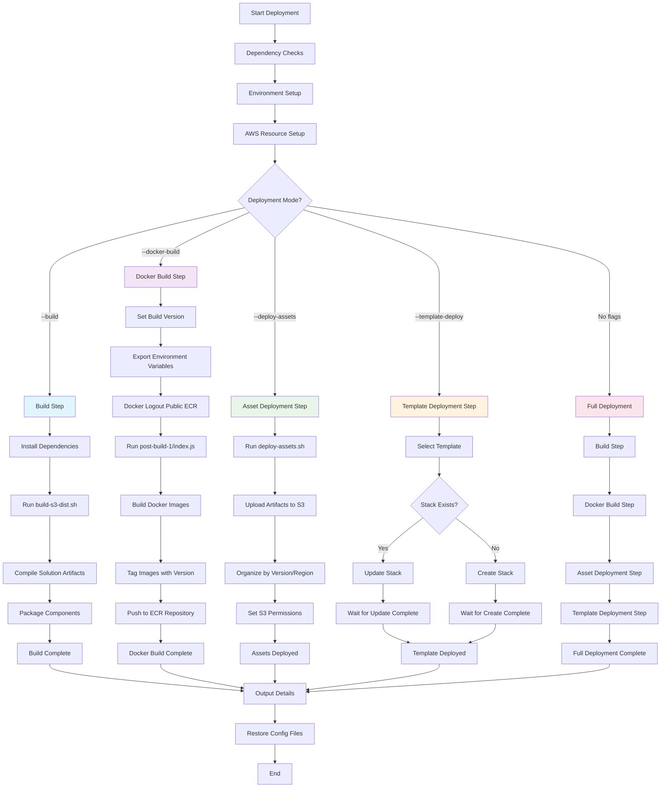

# Clickstream Analytics on AWS - Deployment Script

This script provides an automated deployment solution for the Clickstream Analytics on AWS project, handling the complete end-to-end deployment process.

## Overview

The `solution-deploy.sh` script manages:
- **Dependency validation** - Ensures required tools are installed
- **Environment setup** - Configures AWS resources and parameters
- **Solution building** - Compiles and packages solution artifacts
- **Asset deployment** - Uploads artifacts to S3
- **Container management** - Builds and pushes Docker images to ECR
- **Infrastructure deployment** - Deploys CloudFormation templates

## Prerequisites

Before running the script, ensure you have:

- **AWS CLI** - Configured with appropriate credentials
- **AWS CDK** - For infrastructure deployment
- **Node.js** - Required for build scripts
- **pnpm** - Package manager for Node.js dependencies
- **Docker** - For container image builds
- **Git** - For version tagging

## Usage

### Basic Deployment
```bash
./solution-deploy.sh --region us-east-1 --profile default --email your-email@example.com
```

### Command Line Options

#### Required Parameters
- `-r, --region` - AWS Region (e.g., us-east-1)
- `-p, --profile` - AWS Profile name
- `-e, --email` - Email address for notifications

#### Optional Parameters
- `-n, --solution-name` - Solution name (Default: clickstream-analytics-on-aws)
- `-v, --version` - Solution version (Default: read from ./solution-version file)
- `-b, --bucket` - Base S3 bucket name (Default: clickstream-templates-{VERSION})
- `--platform` - Build platform (Default: linux/amd64)

#### Deployment Flags
- `--build` - Only build solution artifacts
- `--docker-build` - Only build and push Docker images
- `--deploy-assets` - Only deploy artifacts to S3
- `--template-deploy` - Only deploy CloudFormation template
- `--clean` - Clean up build artifacts after deployment

#### Help
- `-h, --help` - Display usage information

## Deployment Modes

### Full Deployment (Default)
Runs all deployment steps when no specific flags are provided:
```bash
./solution-deploy.sh -r us-east-1 -p default -e user@example.com
```

### Selective Deployment
Run specific deployment steps:

**Build Only:**
```bash
./solution-deploy.sh -r us-east-1 -p default -e user@example.com --build
```

**Docker Build Only:**
```bash
./solution-deploy.sh -r us-east-1 -p default -e user@example.com --docker-build
```

**Deploy Assets Only:**
```bash
./solution-deploy.sh -r us-east-1 -p default -e user@example.com --deploy-assets
```

**Template Deploy Only:**
```bash
./solution-deploy.sh -r us-east-1 -p default -e user@example.com --template-deploy
```

## Deployment Flow Diagram



## Step-by-Step Process

### 1. Build Step (`--build`)
```bash
./solution-deploy.sh --region us-east-1 --profile default --email user@example.com --build
```
- **Install Dependencies**: `pnpm install`
- **Run Build Script**: `./build-s3-dist.sh`
- **Compile Artifacts**: Frontend, backend, and CDK components
- **Package Components**: Create deployment-ready packages
- **Output**: Built artifacts in `global-s3-assets/` and `regional-s3-assets/`

### 2. Docker Build Step (`--docker-build`)
```bash
./solution-deploy.sh --region us-east-1 --profile default --email user@example.com --docker-build
```
- **Set Build Version**: Use version from solution-version file
- **Export Variables**: `BUILD_VERSION`, `SOLUTION_ECR_ACCOUNT`, `SOLUTION_ECR_REPO_NAME`
- **Docker Logout**: Clean authentication state
- **Run Build Script**: `node ./post-build-1/index.js`
  - Process CloudFormation templates
  - Find container image references
  - Build missing Docker images:
    - **Frontend**: `src/control-plane/frontend/Dockerfile` → `portal_fn`
    - **Nginx Proxy**: `src/ingestion-server/server/images/nginx/Dockerfile` → `ecs-task-def-proxy`
    - **Vector Worker**: `src/ingestion-server/server/images/vector/Dockerfile` → `ecs-task-def-worker`
- **Tag Images**: Apply version tags
- **Push to ECR**: Upload to repository
- **Output**: Container images in ECR with version tags

### 3. Asset Deployment Step (`--deploy-assets`)
```bash
./solution-deploy.sh --region us-east-1 --profile default --email user@example.com --deploy-assets
```
- **Run Deploy Script**: `./deploy-assets.sh` with bucket, solution name, version, profile, and region parameters
- **Upload to S3**: Copy artifacts to solution bucket
- **Organize Structure**:
  ```
  s3://bucket-name/
  ├── solution-name/
  │   └── version/
  │       ├── *.template.json
  │       └── nested templates/
  └── regional-bucket/
      └── *.zip files
  ```
- **Set Permissions**: Configure S3 access policies
- **Output**: Artifacts available via S3 URLs

### 4. Template Deployment Step (`--template-deploy`)
```bash
./solution-deploy.sh --region us-east-1 --profile default --email user@example.com --template-deploy
```
- **Select Template & Parameters**: 
  - China regions: `cloudfront-s3-control-plane-stack-cn.template.json` with China-specific parameters
  - Global regions: `cloudfront-s3-control-plane-stack-global.template.json` with global parameters
- **Set Domain**: Use appropriate AWS domain (amazonaws.com or amazonaws.com.cn)
- **Create Unique S3 Path**: Copy template to timestamped path to avoid CloudFormation caching
- **Check Stack Status**: `aws cloudformation describe-stacks`
- **Deploy Stack**:
  - **If exists**: `aws cloudformation update-stack` with unique template URL
  - **If new**: `aws cloudformation create-stack` with unique template URL
- **Wait for Completion**: Monitor stack operation
- **Display Stack Outputs**: Show CloudFormation stack outputs in table format
- **Clean Up**: Remove unique S3 template path after deployment
- **Output**: Running CloudFormation stack with outputs

### 5. Full Deployment (No flags)
```bash
./solution-deploy.sh --region us-east-1 --profile default --email user@example.com
```
Executes all steps in sequence:
1. **Build** → 2. **Docker Build** → 3. **Deploy Assets** → 4. **Template Deploy**

## What the Script Does

### 1. Dependency Checks
- Validates AWS CDK installation
- Checks Node.js and pnpm availability
- Verifies Docker installation
- Cleans existing cache and lock files

### 2. Environment Setup
- Parses command line arguments
- Sets up AWS region and profile
- Generates or reuses S3 bucket names
- Configures solution parameters

### 3. AWS Resource Setup
- Creates S3 buckets for solution artifacts
- Sets up ECR repository for container images
- Configures IAM permissions

### 4. Build Process
- Installs project dependencies
- Builds solution artifacts
- Packages components for deployment

### 5. Container Management
- Builds Docker images from source
- Tags images with version information
- Pushes images to ECR repository

### 6. Asset Deployment
- Uploads built artifacts to S3
- Organizes files by version and region
- Sets appropriate permissions

### 7. Infrastructure Deployment
- Deploys CloudFormation templates with region-specific parameters
- Creates or updates existing stacks using unique S3 template URLs
- Waits for deployment completion
- Displays stack outputs in table format
- Cleans up temporary S3 template paths

## Output Information

After successful deployment, the script provides:
- Solution version and name
- AWS account and region details
- S3 bucket URLs for artifacts
- ECR repository URL for container images
- CloudFormation stack status and outputs (in table format)
- Build platform information
- Deployment verification status

## Error Handling

The script includes comprehensive error handling:
- Validates required tools before execution
- Checks AWS credentials and permissions
- Provides detailed error messages
- Automatically restores configuration files on failure
- Exits gracefully with appropriate error codes

## File Management

The script manages several configuration files:
- `solution_config` - Updated with deployment parameters
- `dictionary.json` - Restored after deployment
- `tag-images.sh` - Generated for container tagging
- Temporary files are cleaned up automatically

## Examples

### Development Deployment
```bash
./solution-deploy.sh \
  --region us-west-2 \
  --profile dev \
  --email dev-team@company.com \
  --version v1.0.0-dev
```

### Production Deployment
```bash
./solution-deploy.sh \
  --region us-east-1 \
  --profile prod \
  --email ops-team@company.com \
  --bucket prod-clickstream-templates \
  --clean
```

### Quick Template Update
```bash
./solution-deploy.sh \
  --region us-east-1 \
  --profile default \
  --email user@example.com \
  --template-deploy
```

## Troubleshooting

### Common Issues

**Missing Dependencies:**
- Install required tools (AWS CLI, CDK, Node.js, pnpm, Docker)
- Verify tools are in your PATH

**AWS Permission Errors:**
- Ensure AWS profile has necessary permissions
- Check IAM policies for S3, ECR, and CloudFormation access

**Build Failures:**
- Check Node.js and pnpm versions
- Clear npm/pnpm cache if needed
- Verify internet connectivity for package downloads

**Docker Issues:**
- Ensure Docker daemon is running
- Check Docker permissions
- Verify ECR login credentials

**CloudFormation Deployment S3 Errors:**
- Verify that your template S3 bucket, control plane, and data pipeline are all in the same region

### Debug Mode
The script runs with debug mode enabled (`set -ex`), providing detailed execution logs for troubleshooting.

## Notes

- S3 bucket names are based on the solution version (clickstream-templates-{VERSION})
- Templates use unique timestamped S3 paths to avoid CloudFormation caching issues
- Temporary template S3 paths are automatically cleaned up after deployment
- China regions (cn-northwest-1, cn-north-1) use region-specific templates and parameters
- All AWS resources are tagged appropriately for cost tracking
- The script is idempotent - safe to run multiple times
- Configuration files are automatically backed up and restored
- Stack outputs are displayed in table format for easy reference
- Regional Alignment: The S3 bucket storing templates must be in the same region as your control plane and data pipeline deployments.

## Issues and workaround

- Memory issues - "No space left on device"?
  * Run `docker system prune --volumes -f`
  * Clear unused images.
  * Increase your disk usage limit in your Docker Resources.
